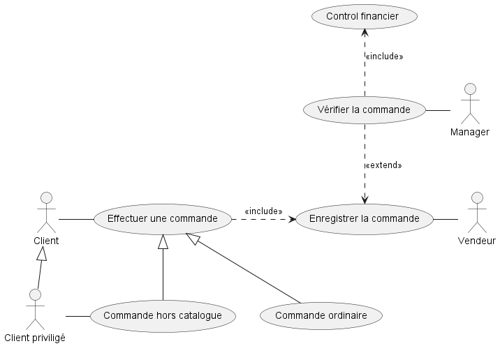
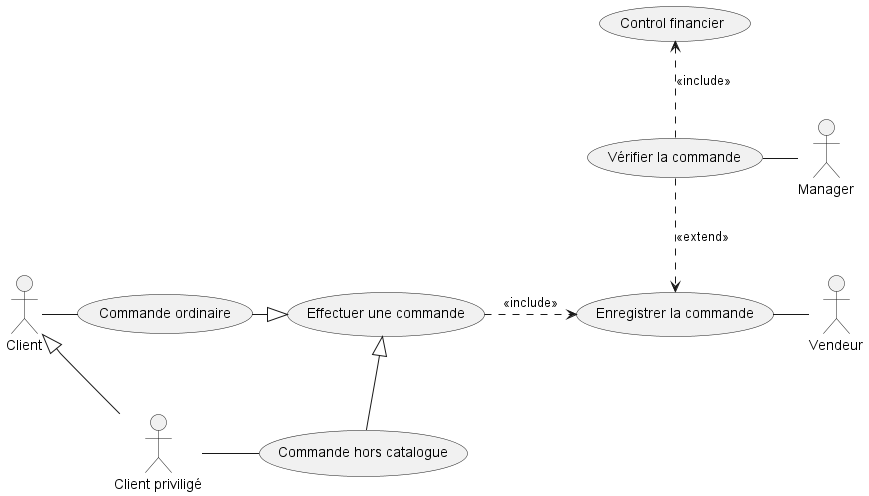

# Use case diagramme

## Vrai ou faux
Etant donné le diagramme de cas d’utilisation ci-dessus, les assertions suivantes sont-elles vraies ou fausses ? 
- Une commande ordinaire est enregistrée par le vendeur : **Vrai**
  - Une commande ordinaire a toutes les caractéristiques d’une commande
  - Effectuer une commande inclut toujours enregistrer la commander
  - Le vendeur est celui qui enregistre la commande
  
- Une commande hors catalogue entraine un contrôle financier : **Faux**
  - Le contrôle financier est une partie de la vérification de la commande 
  - La vérification de la commande étend son enregistrement. Elle est est donc optionnelle
  
- Un client peut effectuer une commande hors catalogue : **Vrai**
  - Un client peut effectuer une commande
  - Il peut donc effectuer toute spécialisation de ce cas d’utilisation, y compris une commande hors catalogue
  
- Le manager peut vérifier la commande sans effectuer de contrôle financier : **Faux**
  - Le contrôle financier est inclut dans la vérification de la commande
  - Il n’est pas optionnel
  
- Un client privilégié peut effectuer une commande ordinaire : **Vrai**
  - Le client privilégié est un client et en a toutes les prérogatives
  - Le client peut effectuer tout type de commande, y compris une commande ordinaire
  

## Modifier le diagramme 
Comment modifier ce diagramme pour qu’un client non privilégié ne puisse effectuer de commande hors catalogue ?

